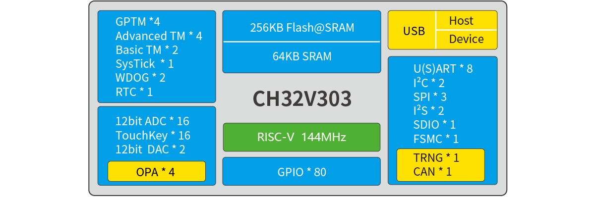
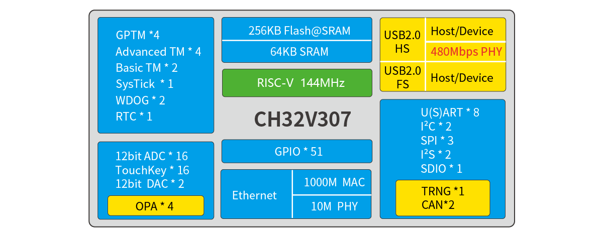
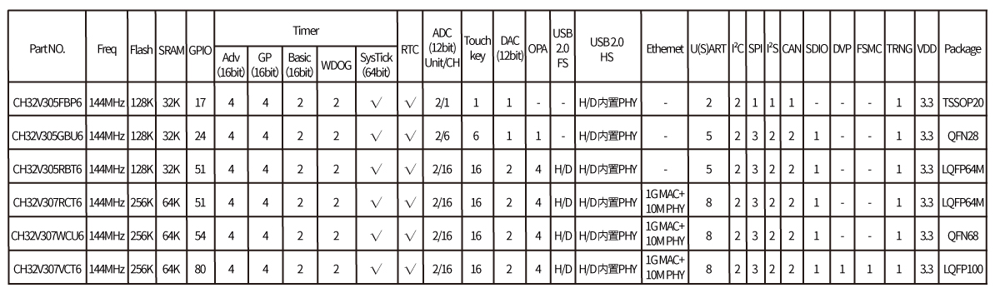
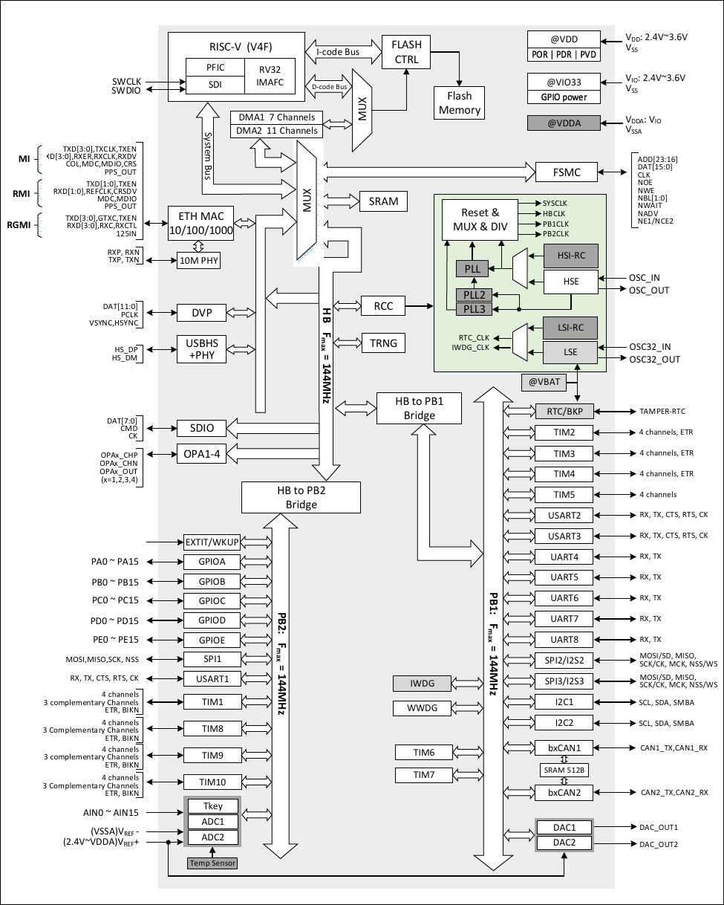

# CH32V303/CH32V307(CH32V305)

| SWCLK | SWDIO | TX1  | RX1  | TX2  | RX2  | TX3  | RX3  | TX4  | RX4  |
|-------|-------|------|------|------|------|------|------|------|------|
| PA14  | PA13  | PA9  | PA10 | PA2  | PA3  | PB10 | PB11 | PC10 | PC11 |

| TX5  | RX5  | TX6  | RX6  | TX7  | RX7  |
|------|------|------|------|------|------|
| PC12 | PD2  | PC0  | PC1  | PC2  | PC3  |

## Official Site

- https://www.wch-ic.com/products/CH32V303.html
- https://www.wch-ic.com/products/CH32V307.html
- https://www.wch.cn/products/CH32V303.html
- https://www.wch.cn/products/CH32V307.html

## Datasheet
- en [[CH32V20x_30xDS0.PDF](https://ch32-riscv-ug.github.io/CH32V307/datasheet_en/CH32V20x_30xDS0.PDF)] [[CH32FV2x_V3xRM.PDF](https://ch32-riscv-ug.github.io/CH32V307/datasheet_en/CH32FV2x_V3xRM.PDF)]
- zh [[CH32V20x_30xDS0.PDF](https://ch32-riscv-ug.github.io/CH32V307/datasheet_zh/CH32V20x_30xDS0.PDF)] [[CH32FV2x_V3xRM.PDF](https://ch32-riscv-ug.github.io/CH32V307/datasheet_zh/CH32FV2x_V3xRM.PDF)]

## System Block Diagram

### CH32V303

### CH32V305/CH32V307

## GPIO Definitions
<table>
    <thead>
        <tr>
            <th>TSSOP&#8203;20</th>
            <th>QFN&#8203;28</th>
            <th>LQFP&#8203;48</th>
            <th>LQFP&#8203;64</th>
            <th>QFN&#8203;68</th>
            <th>LQFP&#8203;100</th>
            <th>Pin name</th>
            <th>Pin type</th>
            <th>I/O structure</th>
            <th>Main function&#8203;(after reset)</th>
            <th>Note</th>
        </tr>
    </thead>
    <tbody align="center">
        <tr>
            <td>-</td>
            <td>-</td>
            <td>10</td>
            <td>14</td>
            <td>14</td>
            <td>23</td>
            <td>PA0-WKUP</td>
            <td>I/O/A</td>
            <td>-</td>
            <td>PA0</td>
            <td></td>
        </tr>
        <tr>
            <td>2</td>
            <td>7</td>
            <td>11</td>
            <td>15</td>
            <td>15</td>
            <td>24</td>
            <td>PA1</td>
            <td>I/O/A</td>
            <td>-</td>
            <td>PA1</td>
            <td></td>
        </tr>
        <tr>
            <td>-</td>
            <td>-</td>
            <td>12</td>
            <td>16</td>
            <td>16</td>
            <td>25</td>
            <td>PA2</td>
            <td>I/O/A</td>
            <td>-</td>
            <td>PA2</td>
            <td>TX2</td>
        </tr>
        <tr>
            <td>-</td>
            <td>-</td>
            <td>13</td>
            <td>17</td>
            <td>19</td>
            <td>26</td>
            <td>PA3</td>
            <td>I/O/A</td>
            <td>-</td>
            <td>PA3</td>
            <td>RX2</td>
        </tr>
        <tr>
            <td>-</td>
            <td>7</td>
            <td>14</td>
            <td>20</td>
            <td>20</td>
            <td>29</td>
            <td>PA4</td>
            <td>I/O/A</td>
            <td>-</td>
            <td>PA4</td>
            <td></td>
        </tr>
        <tr>
            <td>2</td>
            <td>8</td>
            <td>15</td>
            <td>21</td>
            <td>21</td>
            <td>30</td>
            <td>PA5</td>
            <td>I/O/A</td>
            <td>-</td>
            <td>PA5</td>
            <td></td>
        </tr>
        <tr>
            <td>-</td>
            <td>9</td>
            <td>16</td>
            <td>22</td>
            <td>22</td>
            <td>31</td>
            <td>PA6</td>
            <td>I/O/A</td>
            <td>-</td>
            <td>PA6</td>
            <td></td>
        </tr>
        <tr>
            <td>-</td>
            <td>10</td>
            <td>17</td>
            <td>23</td>
            <td>23</td>
            <td>32</td>
            <td>PA7</td>
            <td>I/O/A</td>
            <td>-</td>
            <td>PA7</td>
            <td></td>
        </tr>
        <tr>
            <td></td>
            <td>18</td>
            <td>29</td>
            <td>41</td>
            <td>43</td>
            <td>67</td>
            <td>PA8</td>
            <td>I/O</td>
            <td>FT</td>
            <td>PA8</td>
            <td></td>
        </tr>
        <tr>
            <td>13</td>
            <td>-</td>
            <td>30</td>
            <td>42</td>
            <td>44</td>
            <td>68</td>
            <td>PA9</td>
            <td>I/O</td>
            <td>FT</td>
            <td>PA9</td>
            <td>TX1</td>
        </tr>
        <tr>
            <td>-</td>
            <td>-</td>
            <td>31</td>
            <td>43</td>
            <td>45</td>
            <td>69</td>
            <td>PA10</td>
            <td>I/O</td>
            <td>FT</td>
            <td>PA10</td>
            <td>RX1</td>
        </tr>
        <tr>
            <td>-</td>
            <td></td>
            <td>32</td>
            <td>44</td>
            <td>46</td>
            <td>70</td>
            <td>PA11</td>
            <td>I/O/A</td>
            <td>FT</td>
            <td>PA11</td>
            <td></td>
        </tr>
        <tr>
            <td>-</td>
            <td></td>
            <td>33</td>
            <td>45</td>
            <td>47</td>
            <td>71</td>
            <td>PA12</td>
            <td>I/O/A</td>
            <td>FT</td>
            <td>PA12</td>
            <td></td>
        </tr>
        <tr>
            <td>13</td>
            <td>19</td>
            <td>34</td>
            <td>46</td>
            <td>48</td>
            <td>72</td>
            <td>PA13</td>
            <td>I/O</td>
            <td>FT</td>
            <td>SWDIO</td>
            <td>SWDIO</td>
        </tr>
        <tr>
            <td>15</td>
            <td>22</td>
            <td>37</td>
            <td>49</td>
            <td>52</td>
            <td>76</td>
            <td>PA14</td>
            <td>I/O</td>
            <td>FT</td>
            <td>SWCLK</td>
            <td>SWCLK</td>
        </tr>
        <tr>
            <td>-</td>
            <td>-</td>
            <td>38</td>
            <td>50</td>
            <td>53</td>
            <td>77</td>
            <td>PA15</td>
            <td>I/O</td>
            <td>FT</td>
            <td>PA15</td>
            <td></td>
        </tr>
        <tr>
            <td>-</td>
            <td>-</td>
            <td>18</td>
            <td>26</td>
            <td>26</td>
            <td>35</td>
            <td>PB0</td>
            <td>I/O/A</td>
            <td>-</td>
            <td>PB0</td>
            <td></td>
        </tr>
        <tr>
            <td>-</td>
            <td>-</td>
            <td>19</td>
            <td>27</td>
            <td>27</td>
            <td>36</td>
            <td>PB1</td>
            <td>I/O/A</td>
            <td>-</td>
            <td>PB1</td>
            <td></td>
        </tr>
        <tr>
            <td>-</td>
            <td>-</td>
            <td>20</td>
            <td>28</td>
            <td>28</td>
            <td>37</td>
            <td>PB2</td>
            <td>I/O</td>
            <td>FT</td>
            <td>PB2/BOOT1</td>
            <td></td>
        </tr>
        <tr>
            <td>-</td>
            <td>-</td>
            <td>39</td>
            <td>55</td>
            <td>58</td>
            <td>89</td>
            <td>PB3</td>
            <td>I/O</td>
            <td>FT</td>
            <td>PB3</td>
            <td></td>
        </tr>
        <tr>
            <td>-</td>
            <td>-</td>
            <td>40</td>
            <td>56</td>
            <td>59</td>
            <td>90</td>
            <td>PB4</td>
            <td>I/O</td>
            <td>FT</td>
            <td>PB4</td>
            <td></td>
        </tr>
        <tr>
            <td>-</td>
            <td>-</td>
            <td>41</td>
            <td>57</td>
            <td>60</td>
            <td>91</td>
            <td>PB5</td>
            <td>I/O</td>
            <td>FT</td>
            <td>PB5</td>
            <td></td>
        </tr>
        <tr>
            <td>16</td>
            <td>27</td>
            <td>42</td>
            <td>58</td>
            <td>61</td>
            <td>92</td>
            <td>PB6</td>
            <td>I/O</td>
            <td>FT</td>
            <td>PB6</td>
            <td></td>
        </tr>
        <tr>
            <td>17</td>
            <td>28</td>
            <td>43</td>
            <td>59</td>
            <td>62</td>
            <td>93</td>
            <td>PB7</td>
            <td>I/O</td>
            <td>FT</td>
            <td>PB7</td>
            <td></td>
        </tr>
        <tr>
            <td>-</td>
            <td>-</td>
            <td>45</td>
            <td>61</td>
            <td>64</td>
            <td>95</td>
            <td>PB8</td>
            <td>I/O/A</td>
            <td>FT</td>
            <td>PB8</td>
            <td></td>
        </tr>
        <tr>
            <td>-</td>
            <td>-</td>
            <td>46</td>
            <td>62</td>
            <td>65</td>
            <td>96</td>
            <td>PB9</td>
            <td>I/O/A</td>
            <td>FT</td>
            <td>PB9</td>
            <td></td>
        </tr>
        <tr>
            <td>3</td>
            <td>11</td>
            <td>21</td>
            <td>29</td>
            <td>29</td>
            <td>47</td>
            <td>PB10</td>
            <td>I/O/A</td>
            <td>FT</td>
            <td>PB10</td>
            <td>TX3</td>
        </tr>
        <tr>
            <td>4</td>
            <td>12</td>
            <td>22</td>
            <td>30</td>
            <td>30</td>
            <td>48</td>
            <td>PB11</td>
            <td>I/O/A</td>
            <td>FT</td>
            <td>PB11</td>
            <td>RX3</td>
        </tr>
        <tr>
            <td>5</td>
            <td>13</td>
            <td>25</td>
            <td>33</td>
            <td>35</td>
            <td>51</td>
            <td>PB12</td>
            <td>I/O/A</td>
            <td>FT</td>
            <td>PB12</td>
            <td></td>
        </tr>
        <tr>
            <td>6</td>
            <td>14</td>
            <td>26</td>
            <td>34</td>
            <td>36</td>
            <td>52</td>
            <td>PB13</td>
            <td>I/O/A</td>
            <td>FT</td>
            <td>PB13</td>
            <td></td>
        </tr>
        <tr>
            <td>7</td>
            <td>15</td>
            <td>27</td>
            <td>35</td>
            <td>37</td>
            <td>53</td>
            <td>PB14</td>
            <td>I/O/A</td>
            <td>FT</td>
            <td>PB14</td>
            <td></td>
        </tr>
        <tr>
            <td>8</td>
            <td>16</td>
            <td>28</td>
            <td>36</td>
            <td>38</td>
            <td>54</td>
            <td>PB15</td>
            <td>I/O/A</td>
            <td>FT</td>
            <td>PB15</td>
            <td></td>
        </tr>
        <tr>
            <td>-</td>
            <td>-</td>
            <td>-</td>
            <td>8</td>
            <td>8</td>
            <td>15</td>
            <td>PC0</td>
            <td>I/O/A</td>
            <td>-</td>
            <td>PC0</td>
            <td>TX6</td>
        </tr>
        <tr>
            <td>-</td>
            <td>-</td>
            <td>-</td>
            <td>9</td>
            <td>9</td>
            <td>16</td>
            <td>PC1</td>
            <td>I/O/A</td>
            <td>-</td>
            <td>PC1</td>
            <td>RX6</td>
        </tr>
        <tr>
            <td>-</td>
            <td>4</td>
            <td>-</td>
            <td>10</td>
            <td>10</td>
            <td>17</td>
            <td>PC2</td>
            <td>I/O/A</td>
            <td>-</td>
            <td>PC2</td>
            <td>TX7</td>
        </tr>
        <tr>
            <td>-</td>
            <td>5</td>
            <td>-</td>
            <td>11</td>
            <td>11</td>
            <td>18</td>
            <td>PC3</td>
            <td>I/O/A</td>
            <td>-</td>
            <td>PC3</td>
            <td>RX7</td>
        </tr>
        <tr>
            <td>-</td>
            <td>-</td>
            <td>-</td>
            <td>24</td>
            <td>24</td>
            <td>33</td>
            <td>PC4</td>
            <td>I/O/A</td>
            <td>-</td>
            <td>PC4</td>
            <td></td>
        </tr>
        <tr>
            <td>-</td>
            <td>-</td>
            <td>-</td>
            <td>25</td>
            <td>25</td>
            <td>34</td>
            <td>PC5</td>
            <td>I/O/A</td>
            <td>-</td>
            <td>PC5</td>
            <td></td>
        </tr>
        <tr>
            <td>9</td>
            <td>-</td>
            <td>-</td>
            <td>37</td>
            <td>39</td>
            <td>63</td>
            <td>PC6</td>
            <td>I/O</td>
            <td>FT</td>
            <td>PC6</td>
            <td></td>
        </tr>
        <tr>
            <td>10</td>
            <td>-</td>
            <td>-</td>
            <td>38</td>
            <td>40</td>
            <td>64</td>
            <td>PC7</td>
            <td>I/O</td>
            <td>FT</td>
            <td>PC7</td>
            <td></td>
        </tr>
        <tr>
            <td>11</td>
            <td>17</td>
            <td>-</td>
            <td>39</td>
            <td>41</td>
            <td>65</td>
            <td>PC8</td>
            <td>I/O</td>
            <td>FT</td>
            <td>PC8</td>
            <td></td>
        </tr>
        <tr>
            <td>12</td>
            <td>18</td>
            <td>-</td>
            <td>40</td>
            <td>42</td>
            <td>66</td>
            <td>PC9</td>
            <td>I/O</td>
            <td>FT</td>
            <td>PC9</td>
            <td></td>
        </tr>
        <tr>
            <td>-</td>
            <td>23</td>
            <td>-</td>
            <td>51</td>
            <td>54</td>
            <td>78</td>
            <td>PC10</td>
            <td>I/O</td>
            <td>FT</td>
            <td>PC10</td>
            <td>TX4</td>
        </tr>
        <tr>
            <td>-</td>
            <td>24</td>
            <td>-</td>
            <td>52</td>
            <td>55</td>
            <td>79</td>
            <td>PC11</td>
            <td>I/O</td>
            <td>FT</td>
            <td>PC11</td>
            <td>RX4</td>
        </tr>
        <tr>
            <td>-</td>
            <td>25</td>
            <td>-</td>
            <td>53</td>
            <td>56</td>
            <td>80</td>
            <td>PC12</td>
            <td>I/O</td>
            <td>FT</td>
            <td>PC12</td>
            <td>TX5</td>
        </tr>
        <tr>
            <td>-</td>
            <td>-</td>
            <td>2</td>
            <td>2</td>
            <td>2</td>
            <td>7</td>
            <td>PC13-TAMPER RTC</td>
            <td>I/O</td>
            <td>-</td>
            <td>PC13</td>
            <td></td>
        </tr>
        <tr>
            <td>-</td>
            <td>-</td>
            <td>3</td>
            <td>3</td>
            <td>3</td>
            <td>8</td>
            <td>PC14-OSC32_IN</td>
            <td>I/O/A</td>
            <td>-</td>
            <td>PC14</td>
            <td></td>
        </tr>
        <tr>
            <td>-</td>
            <td>-</td>
            <td>4</td>
            <td>4</td>
            <td>4</td>
            <td>9</td>
            <td>PC15-OSC32_OUT</td>
            <td>I/O/A</td>
            <td>-</td>
            <td>PC15</td>
            <td></td>
        </tr>
        <tr>
            <td>-</td>
            <td>1</td>
            <td>-</td>
            <td>-</td>
            <td>-</td>
            <td>81</td>
            <td>PD0</td>
            <td>I/O/A</td>
            <td>FT</td>
            <td>PD0</td>
            <td></td>
        </tr>
        <tr>
            <td>-</td>
            <td>2</td>
            <td>-</td>
            <td>-</td>
            <td>-</td>
            <td>82</td>
            <td>PD1</td>
            <td>I/O/A</td>
            <td>FT</td>
            <td>PD1</td>
            <td></td>
        </tr>
        <tr>
            <td>-</td>
            <td>26</td>
            <td>-</td>
            <td>54</td>
            <td>57</td>
            <td>83</td>
            <td>PD2</td>
            <td>I/O</td>
            <td>FT</td>
            <td>PD2</td>
            <td>RX5</td>
        </tr>
        <tr>
            <td>-</td>
            <td>-</td>
            <td>-</td>
            <td>-</td>
            <td>-</td>
            <td>84</td>
            <td>PD3</td>
            <td>I/O</td>
            <td>FT</td>
            <td>PD3</td>
            <td></td>
        </tr>
        <tr>
            <td>-</td>
            <td>-</td>
            <td>-</td>
            <td>-</td>
            <td>-</td>
            <td>85</td>
            <td>PD4</td>
            <td>I/O</td>
            <td>FT</td>
            <td>PD4</td>
            <td></td>
        </tr>
        <tr>
            <td>-</td>
            <td>-</td>
            <td>-</td>
            <td>-</td>
            <td>-</td>
            <td>86</td>
            <td>PD5</td>
            <td>I/O</td>
            <td>FT</td>
            <td>PD5</td>
            <td></td>
        </tr>
        <tr>
            <td>-</td>
            <td>-</td>
            <td>-</td>
            <td>-</td>
            <td>-</td>
            <td>87</td>
            <td>PD6</td>
            <td>I/O</td>
            <td>FT</td>
            <td>PD6</td>
            <td></td>
        </tr>
        <tr>
            <td>-</td>
            <td>-</td>
            <td>-</td>
            <td>-</td>
            <td>-</td>
            <td>88</td>
            <td>PD7</td>
            <td>I/O</td>
            <td>FT</td>
            <td>PD7</td>
            <td></td>
        </tr>
        <tr>
            <td>-</td>
            <td>-</td>
            <td>-</td>
            <td>-</td>
            <td>33</td>
            <td>55</td>
            <td>PD8</td>
            <td>I/O</td>
            <td>FT</td>
            <td>PD8</td>
            <td></td>
        </tr>
        <tr>
            <td>-</td>
            <td>-</td>
            <td>-</td>
            <td>-</td>
            <td>34</td>
            <td>56</td>
            <td>PD9</td>
            <td>I/O</td>
            <td>FT</td>
            <td>PD9</td>
            <td></td>
        </tr>
        <tr>
            <td>-</td>
            <td>-</td>
            <td>-</td>
            <td>-</td>
            <td>-</td>
            <td>57</td>
            <td>PD10</td>
            <td>I/O</td>
            <td>FT</td>
            <td>PD10</td>
            <td></td>
        </tr>
        <tr>
            <td>-</td>
            <td>-</td>
            <td>-</td>
            <td>-</td>
            <td>-</td>
            <td>58</td>
            <td>PD11</td>
            <td>I/O</td>
            <td>FT</td>
            <td>PD11</td>
            <td></td>
        </tr>
        <tr>
            <td>-</td>
            <td>-</td>
            <td>-</td>
            <td>-</td>
            <td>-</td>
            <td>59</td>
            <td>PD12</td>
            <td>I/O</td>
            <td>FT</td>
            <td>PD12</td>
            <td></td>
        </tr>
        <tr>
            <td>-</td>
            <td>-</td>
            <td>-</td>
            <td>-</td>
            <td>-</td>
            <td>60</td>
            <td>PD13</td>
            <td>I/O</td>
            <td>FT</td>
            <td>PD13</td>
            <td></td>
        </tr>
        <tr>
            <td>-</td>
            <td>-</td>
            <td>-</td>
            <td>-</td>
            <td>-</td>
            <td>61</td>
            <td>PD14</td>
            <td>I/O</td>
            <td>FT</td>
            <td>PD14</td>
            <td></td>
        </tr>
        <tr>
            <td>-</td>
            <td>-</td>
            <td>-</td>
            <td>-</td>
            <td>-</td>
            <td>62</td>
            <td>PD15</td>
            <td>I/O</td>
            <td>FT</td>
            <td>PD15</td>
            <td></td>
        </tr>
        <tr>
            <td>-</td>
            <td>-</td>
            <td>-</td>
            <td>-</td>
            <td>66</td>
            <td>97</td>
            <td>PE0</td>
            <td>I/O</td>
            <td>FT</td>
            <td>PE0</td>
            <td></td>
        </tr>
        <tr>
            <td>-</td>
            <td>-</td>
            <td>-</td>
            <td>-</td>
            <td>-</td>
            <td>98</td>
            <td>PE1</td>
            <td>I/O</td>
            <td>FT</td>
            <td>PE1</td>
            <td></td>
        </tr>
        <tr>
            <td>-</td>
            <td>-</td>
            <td>-</td>
            <td>-</td>
            <td>-</td>
            <td>1</td>
            <td>PE2</td>
            <td>I/O</td>
            <td>FT</td>
            <td>PE2</td>
            <td></td>
        </tr>
        <tr>
            <td>-</td>
            <td>-</td>
            <td>-</td>
            <td>-</td>
            <td>-</td>
            <td>2</td>
            <td>PE3</td>
            <td>I/O</td>
            <td>FT</td>
            <td>PE3</td>
            <td></td>
        </tr>
        <tr>
            <td>-</td>
            <td>-</td>
            <td>-</td>
            <td>-</td>
            <td>-</td>
            <td>3</td>
            <td>PE4</td>
            <td>I/O</td>
            <td>FT</td>
            <td>PE4</td>
            <td></td>
        </tr>
        <tr>
            <td>-</td>
            <td>-</td>
            <td>-</td>
            <td>-</td>
            <td>-</td>
            <td>4</td>
            <td>PE5</td>
            <td>I/O</td>
            <td>FT</td>
            <td>PE5</td>
            <td></td>
        </tr>
        <tr>
            <td>-</td>
            <td>-</td>
            <td>-</td>
            <td>-</td>
            <td>-</td>
            <td>5</td>
            <td>PE6</td>
            <td>I/O</td>
            <td>FT</td>
            <td>PE6</td>
            <td></td>
        </tr>
        <tr>
            <td>-</td>
            <td>-</td>
            <td>-</td>
            <td>-</td>
            <td>-</td>
            <td>38</td>
            <td>PE7</td>
            <td>I/O/A</td>
            <td>FT</td>
            <td>PE7</td>
            <td></td>
        </tr>
        <tr>
            <td>-</td>
            <td>-</td>
            <td>-</td>
            <td>-</td>
            <td>-</td>
            <td>39</td>
            <td>PE8</td>
            <td>I/O/A</td>
            <td>FT</td>
            <td>PE8</td>
            <td></td>
        </tr>
        <tr>
            <td>-</td>
            <td>-</td>
            <td>-</td>
            <td>-</td>
            <td>-</td>
            <td>40</td>
            <td>PE9</td>
            <td>I/O</td>
            <td>FT</td>
            <td>PE9</td>
            <td></td>
        </tr>
        <tr>
            <td>-</td>
            <td>-</td>
            <td>-</td>
            <td>-</td>
            <td>-</td>
            <td>41</td>
            <td>PE10</td>
            <td>I/O</td>
            <td>FT</td>
            <td>PE10</td>
            <td></td>
        </tr>
        <tr>
            <td>-</td>
            <td>-</td>
            <td>-</td>
            <td>-</td>
            <td>-</td>
            <td>42</td>
            <td>PE11</td>
            <td>I/O</td>
            <td>FT</td>
            <td>PE11</td>
            <td></td>
        </tr>
        <tr>
            <td>-</td>
            <td>-</td>
            <td>-</td>
            <td>-</td>
            <td>-</td>
            <td>43</td>
            <td>PE12</td>
            <td>I/O</td>
            <td>FT</td>
            <td>PE12</td>
            <td></td>
        </tr>
        <tr>
            <td>-</td>
            <td>-</td>
            <td>-</td>
            <td>-</td>
            <td>-</td>
            <td>44</td>
            <td>PE13</td>
            <td>I/O</td>
            <td>FT</td>
            <td>PE13</td>
            <td></td>
        </tr>
        <tr>
            <td>-</td>
            <td>-</td>
            <td>-</td>
            <td>-</td>
            <td>-</td>
            <td>45</td>
            <td>PE14</td>
            <td>I/O/A</td>
            <td>FT</td>
            <td>PE14</td>
            <td></td>
        </tr>
        <tr>
            <td>-</td>
            <td>-</td>
            <td>-</td>
            <td>-</td>
            <td>-</td>
            <td>46</td>
            <td>PE15</td>
            <td>I/O/A</td>
            <td>FT</td>
            <td>PE15</td>
            <td></td>
        </tr>
    </tbody>
</table>

## System Architecture

